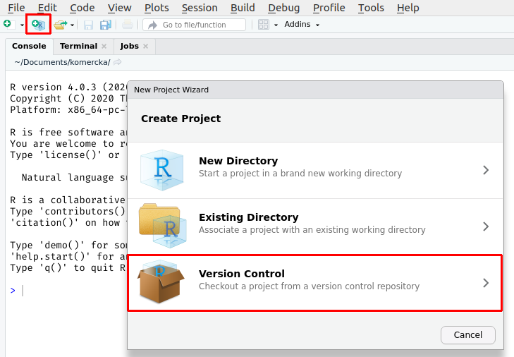
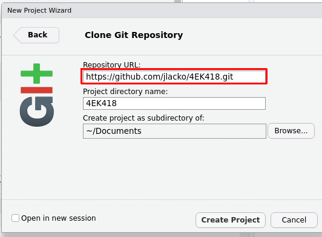
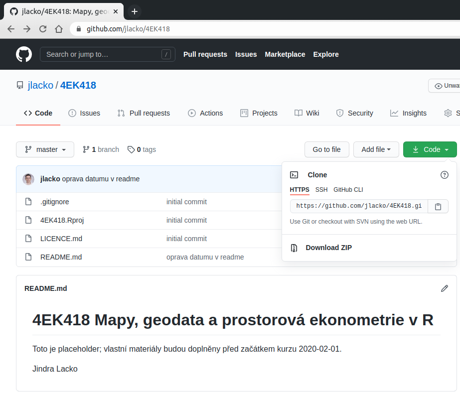
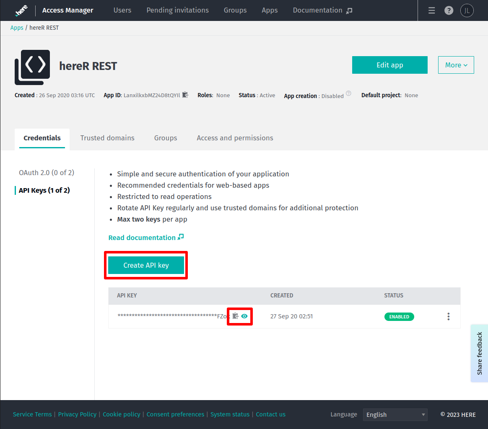

```{r setup, include=FALSE}
knitr::opts_chunk$set(echo = TRUE, fig.align="center")
```

Kurs *Mapy, geodata a prostorová ekonometrie v R* proběhne prezenční formou, což klade o něco menší nároky na prostředí nežli vzdálená forma přes Týmsy.

Pokud budete chtít procházet kód a úlohy na vlastním technickém prostředí, což velmi doporučuji, tak budete muset splnit několik technických kroků; postupujte přitom podle návodu níže.

V první řadě budete potřebovat přiměřeně čerstvé R a RStudio. V ideálním případě R 4.2.2 a RStudio 2022.12.0+353 "Elsbeth Geranium" - stačit bude jakákoliv čtyřková verze erka a RStudio může být i nižší. Ale toto je konfigurace, kterou budu používat při prezentaci.

Dále bude třeba nainstalovat balíčky použité v kurzu; nejsnáze to uděláte vykopírováním a spuštěním kódu níže.

```{r instalace-packagi, eval = F}
# toto potřebuju:
required <- c("czso", "dplyr", "ggplot2", "giscoR", "gtools", "hereR",
              "htmltools", "knitr", "leaflet", "lwgeom", "mapview", "exactextractr",
              "nngeo", "osmdata", "raster", "RCzechia", "readr", "remotes",
              "rgeoda", "rmapshaper", "rmarkdown", "scales", "sf", "spdep",
              "tidygeocoder", "tidyr", "tidyverse")
# toto mám:
installed <- installed.packages()[, "Package"]

# a tedy rozdíl stahnu z CRANu...
install.packages(setdiff(required, installed))
```

Instalace balíčků by měla proběhnout bez větších složitostí - zejména v prostředí Windows, kde jsou k dispozici předkompilované binárky - ale komplikace se dopředu nedají zcela vyloučit.

Budu proto rád, když si instalaci provedete v klidu a v předstihu, a nebudeme muset problematické balíčky řešit za pochodu. 

Dále bude potřeba, abyste měli funkční git - ve Windows prostředí je k tomu asi nejsnazší použít funkci `installr::install.git()` a potvrdit nabízené volby (defaulty dávají smysl).

V prostředí Linuxu a jemu podobných OS budete muset nainstalovat git [vlastní cestou](https://github.com/git-guides/install-git).

```{r instalace-gitu, eval = F}
install.packages("installr") # pokud nemáte z předchozího kroku...
installr::install.git() 
```

\newpage

Když budete mít git funkční tak prosím v rámci RStudia založte nový projekt metodou z hlavní nabídky `File >> New Project >> Version Control >> Git`, a coby cestu k repozitáři zadáte [`https://github.com/jlacko/4EK418.git`](https://github.com/jlacko/4EK418.git). 

\bcenter

{width=500px}

{width=500px}

\ecenter

Vyklonováním získáte aktivní projekt, do kterého budu vkládat kurzovné materiály. Snadno si jej aktualizujete příkazem Pull na záložce Git (modrá šipka směrem dolů). Zatím je to prázdná schránka, ale až začneme tak budou materiály doplněny.

\bcenter

{width=500px}

\ecenter

\newpage

Nakonec, jako ne povinnou, ale velmi doporučenou, aktivitu proveďte registraci na [developer.here.com](https://developer.here.com/). HERE je platforma věnující se mapování a navigaci (dříve známá jako Nokia Maps) a s jejím API pracuje balíček `{hereR}`. Registrace je zdarma, a do jejich free tieru 250 tisíc dotazů měsíčně se vejdete s velkou rezervou - ale pro práci s `{hereR}` budete potřebovat vlastní API klíč.

\bcenter

{width=500px}

\ecenter

API klíč získáte tak, že v rámci platformy vygenereujete projekt - já ten svůj nazval hereR podle balíčku `{hereR}`, ale není to podmínka - a poté zvolíte Create API key; standardně je skrytý za hvězdičkami, ukázat jde přes ikonu očička (a COPY ho zkopíruje do schránky; to je nejpraktičtější).

Na použití klíče dojde v druhé polovině kurzu, takže tento krok tolik nespěchá.

Jindra Lacko
