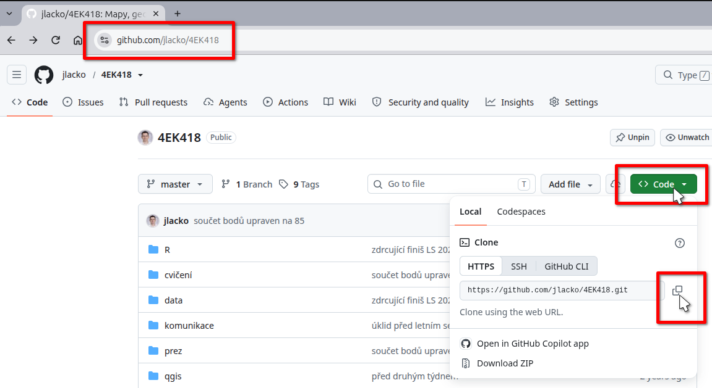
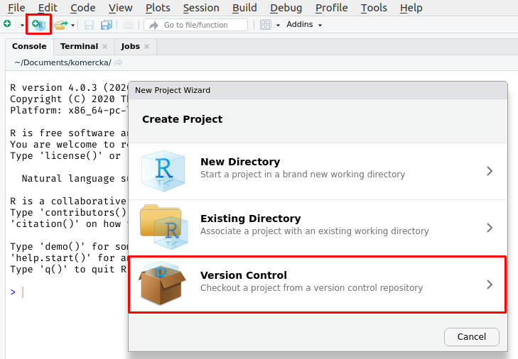
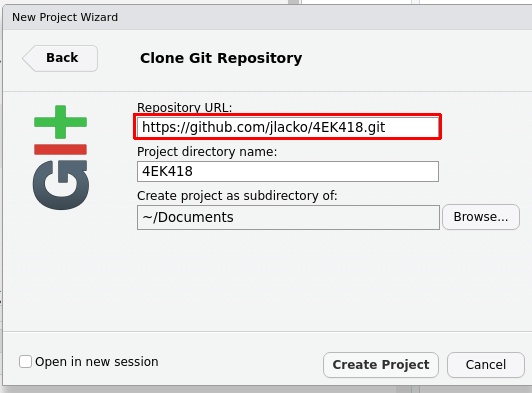
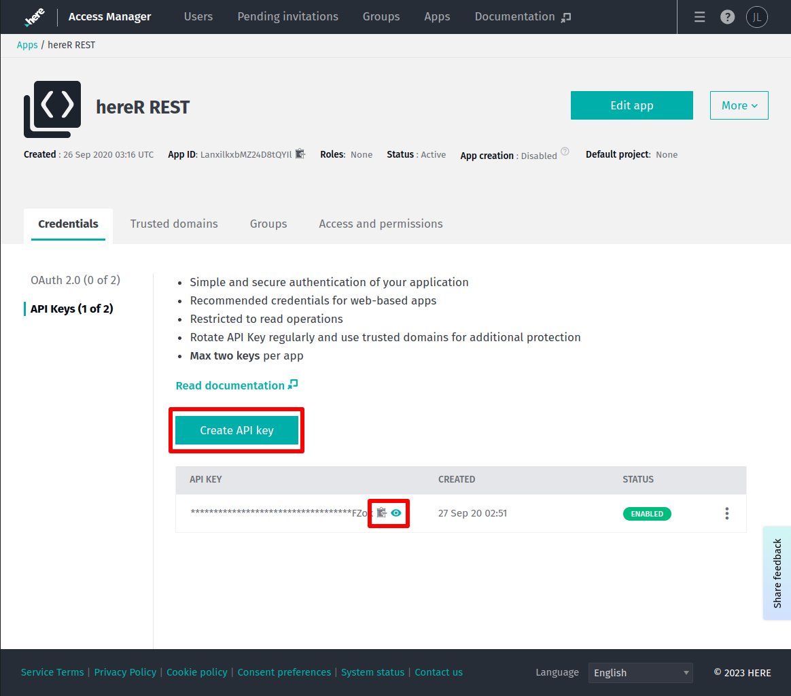

```{r setup, include=FALSE}
knitr::opts_chunk$set(echo = TRUE, fig.align="center")
```

Pro aktivní účast na kurzu *Mapy, geodata a prostorová ekonometrie v R* velmi oceníte vlastní technické prostředí; školní počítače sice (většinou) fungují, ale pro pro skutečné sžití se s daty a kódem je praktické si materiály odnést s sebou a pracovat s nimi doma. Pro nastavení vlastního prostředí doporučuji postupovat podle podle návodu níže.

V první řadě budete potřebovat přiměřeně čerstvé R a RStudio. V ideálním případě 4.6.1 (2026-06-24) -- "Happy Hop" a RStudio 2026.09.0+174 "Autumn Hawkbit" -- ale stačit bude jakákoliv čtyřková verze erka a RStudio může být i nižší. Nicméně toto je konfigurace, kterou budu používat já při prezentaci.

Dále bude třeba nainstalovat balíčky použité v kurzu; nejsnáze to uděláte vykopírováním a spuštěním kódu níže. Pozor! kód může běžet vyšší jednotky či nižší desítky minut.

```{r instalace-packagi, eval = F}
# toto mám:
installed <- installed.packages()[, "Package"]

# toto potřebuju:
required <- c("czso", "DHARMa", "dplyr", "exactextractr",
              "geojsonsf", "ggplot2", "giscoR", "glmmTMB",
              "gstat", "gtools", "hereR", "htmltools", "knitr",
              "leaflet", "lwgeom", "mapview", "nngeo",
              "osmdata", "RCzechia", "readr", "remotes",
              "rgeoda", "rmapshaper", "rmarkdown", "scales",
              "sf", "spdep", "stars", "terra", "tidygeocoder",
              "tidyr", "tidyverse")

# chybějící balíčky nainstaluji z CRANu
install.packages(pkgs = setdiff(required, installed))

# existující balíčky povýším na aktuální verzi
update.packages(ask = FALSE, oldPkgs = intersect(required, installed))
```

Instalace balíčků by měla proběhnout bez větších složitostí - zejména v prostředí Windows, kde jsou k dispozici předkompilované binárky - ale komplikace se dopředu nedají zcela vyloučit.

Budu proto rád, když si instalaci provedete v klidu a v předstihu, a nebudeme muset problematické balíčky řešit za pochodu. 

Dále bude potřeba, abyste měli funkční git - ve Windows prostředí je k tomu asi nejsnazší použít funkci `installr::install.git()` a potvrdit nabízené volby (defaulty dávají smysl).

V prostředí Linuxu a jemu podobných OS budete muset nainstalovat git [vlastní cestou](https://github.com/git-guides/install-git).

```{r instalace-gitu, eval = F}
install.packages("installr") # pokud nemáte z předchozího kroku...
installr::install.git() 
```

\newpage

Když budete mít git funkční, tak prosím v rámci RStudia založte nový projekt metodou z hlavní nabídky:  `File >> New Project >> Version Control >> Git`, a coby cestu k repozitáři zadejdte [`https://github.com/jlacko/4EK418.git`](https://github.com/jlacko/4EK418.git). 

Alternativou je link vzít ze GitHubového repozitáře kurzu, který "bydlí" na odkazu https://github.com/jlacko/4EK418 (tyto stránky se mohou hodit i v budoucnu, budu je aktualizovat).

\bcenter

{width=500px}

\ecenter

V každém případě je třeba ve "svém" RStudiu založit nový projekt, a hlídat si že ho máte aktivní. Aktivní projekt vám zaručí, že bude fungovat git integrace, a že skripty budou vědět kde na disku je aktuální adresář. Díky tomu budou očekávaným způsobem fungovat relativní linky v kódu (například odkazy na načtení dat).

\bcenter

{width=300px} {width=300px}

\ecenter

Vyklonováním získáte aktivní projekt, do kterého budu vkládat kurzovné materiály. V rámci RStudia si jej pak snadno aktualizujete příkazem Pull na záložce Git (modrá šipka směrem dolů). 


\newpage

Nakonec, jako ne povinnou, ale velmi doporučenou, aktivitu proveďte registraci na [platform.here.com](https://platform.here.com/). HERE je platforma věnující se mapování a navigaci (dříve známá jako Nokia Maps) a s jejím API pracuje balíček `{hereR}`. Registrace je zdarma, a do jejich free tieru 30 tisíc dotazů měsíčně se vejdete s velkou rezervou - ale pro práci s `{hereR}` budete potřebovat vlastní API klíč.

\bcenter

{width=500px}

\ecenter

API klíč získáte tak, že v rámci platformy vygenereujete projekt - já ten svůj nazval hereR podle balíčku `{hereR}`, ale není to podmínka - a poté zvolíte Create API key; standardně je skrytý za hvězdičkami, ukázat jde přes ikonu očička (a COPY ho zkopíruje do schránky; to je nejpraktičtější).

Na použití klíče dojde v druhé polovině kurzu, takže tento krok tolik nespěchá.

Jindra Lacko
